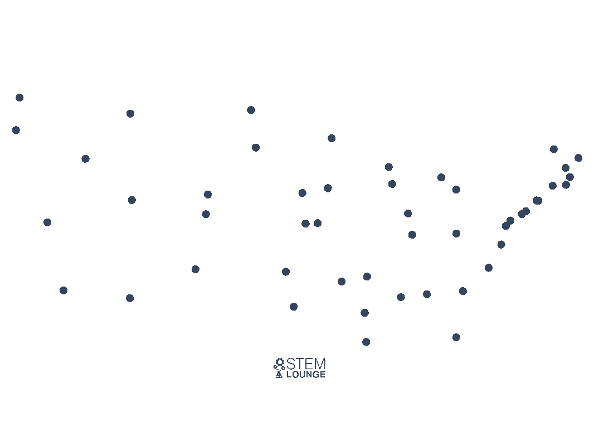
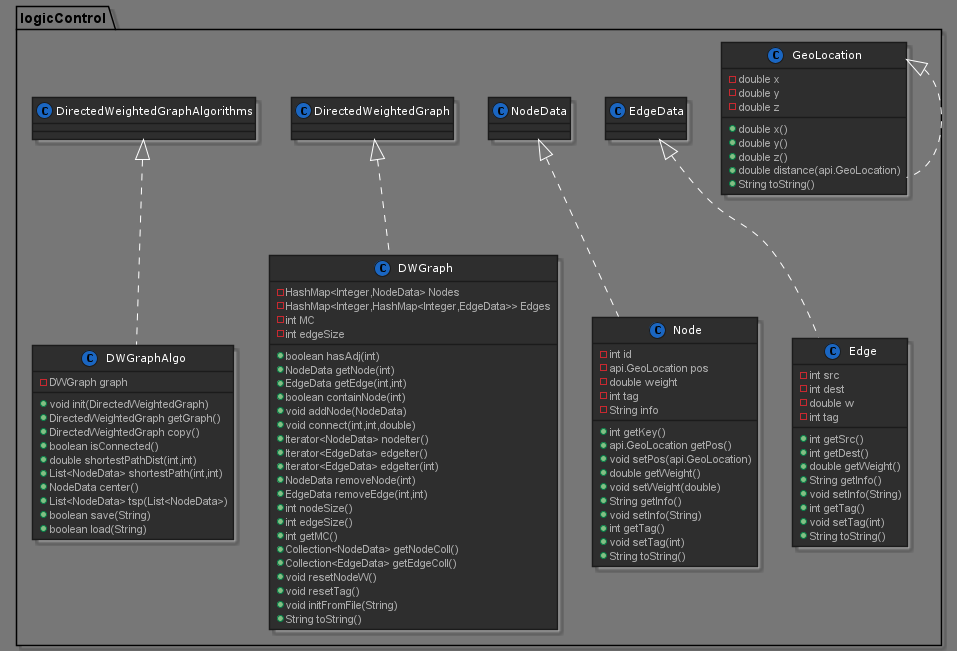

# Weighted directed graphs (directed networks)

> Made by Elad Seznayev and Nerya Bigon.
* As part of OOP course assignment.

## Goal:
The goal of this assignment is to design and implement two key interfaces:
* Weighted directed graph interface.
* Weighted directed graphs algorithms interface.  

In addition we'll create a graphical inteface that allows you to load graphs from files, save them, edit them and run algorithms on them.   

## Algorithms:
* `isConnected` - return whether the graph is strongly connected or not.  
We've implemented the algorithm in the following way:    
  1. Run BFS algorithms from a specific node to all of the other nodes
  2. Run BFS again, this time on the graph transposed.
  3. Check if the BFS's results are equals to each othe and to the nuber of nodes in the graph.
  4. If so - the graph is strongly connected.  

* `shortestPathDist` - return the distance of the shortest path between two nodes.  
We've implemented the algorithm in the following way:    
  1. Run DIJKSTRA algorithm on the source node - in order to get in each node the shortest path from the source, and the distance. 
  2. The answer is contained in the destination node's weight parameter.
  3. So we return it.  

* `shortestPath` - return the shortest path between two nodes.  
We've implemented the algorithm in the following way:    
  1. Run DIJKSTRA algorithm on the source node - in order to get in each node the shortest path from the source, and the distance. 
  2. Because each node tag "carry" the node that came before it in the path, all there is to do is to loop from the destination node and ask who came before until we get to the source node.
  3. The results are then inserted into a list and returned.  

* `center` - return the node that is the closest to every other node.   
**Approach:** we are searching for the node with the shortest path, but from the longest result this node got from `shortestPathDist`.
We've implemented the algorithm in the following way:    
  1. Loop through all of the nodes in the graph.
  2. For each node check with `shortestPathDist` what is the **longest** path
  3. Return the node with the shortest one.  

* `tsp` - return the shrotest path between a list of nodes.   
**Approach:** we are using swaping algorithm, in order to get an acceptble path at reasonble time.
We've implemented the algorithm in the following way:    
  1. Start with a random route that start in the source node.
  2. Perform a swap between nodes (except the source).
  3. Keep new route if it is shorter.
  4. Repeat (2-3) for all possible swaps.
since in this assignment we are not required to return to the source node it's simplify the solution a bit.  
This algorithm is both faster, O(M*N^2) and produces better solutions then greedy algorithm.  
The intuition behind the algorithm is that swapping untangles routes that cross over itself (gets rid of circel's when posible).  
This swap algorithm performed much better than greedy; the path it drew looks similar to something a human might draw.




## Structure:  

Class | Description
----- | -----------
`Ex2` | The main class, that drive everything.
`DWGraph` | This class represent the graph -> implements the DirectedWeightedGraph interface.
`DWGraphAlgo` | this class holds all of the algorithms -> implements the DirectedWeightedGraphAlgorithms interface.
`Edge` | This class represent an edge -> impelments the EdgeData interface.
`Node` | This class represent a node -> impelments the NodeData interface.


### UML:
  

## Results:
### Load Graph:
G1 - 33 ms  
G2 - 35 ms  
G3 - 39 ms    
1000 vertices - 115 ms  
10000 vertices - 418 ms  
### Running Algorithms:
##### `Center`:
G1 - 13 ms  
G2 - 16 ms  
G3 - 69 ms  
1000 vertices - 3 sec 600 ms  
10000 vertices - timeout  
##### `Isconnected`:  
G1 - 7 ms  
G2 - 7 ms  
G3 - 8 ms  
1000 vertices - 76 ms  
10000 vertices - 533 ms  
##### `TSP` (path of 7 nodes):
G1 - 15 ms  
G2 - 25 ms  
G3 - 37 ms  
1000 vertices - 16 sec  
10000 vertices - timeout  


# GUI:
In addition we've implemented GUI interface that allow interaction with the code and algorithms in a graphical and interactive way.  

#### To use the GUI do the follwing: 
1. Download the Ex2.jar file that can be found in the main folder of this repository.
2. Put the Ex2.jar file in a foder along with a json file that represent a graph, (such files can be found in the Data folder in this repository).
3. Open a terminal in this folder, and run the following comand:  

```
java -jar Ex2.jar <graph.json>
```  

## How To Run:
To run the algorithms, without the GUI interface, do the following:
1. Download this repository and open it in an IDE.
2. In the Ex2.java (in the src folder) go to the bottom of the file and choose a graph (json graph files can be found in the Data folder).
3. Next choose an algorithm to run on the graph, and finaly run the main function in the Ex2.java file. 

 
